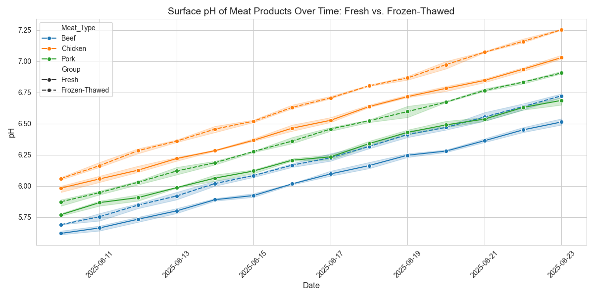

# Surface pH Analysis of Meat Products

### 📋 Project Overview

This project analyzes surface pH changes in meat products (beef, chicken, pork) under two storage conditions: **fresh** and **frozen-thawed**. The goal is to understand how storage impacts pH over 14 days to inform spoilage patterns and support food safety auditing.

The analysis includes:
- Statistical tests: **t-tests**, **ANOVA**, **correlations**
- Visualizations: **line plots**, **box plots**, **scatter plots with regression lines**

Currently, the project uses **fake data** to simulate pH measurements for 252 samples:  
> 3 meats × 2 groups × 3 replicates × 14 days

In **June 2025**, I plan to collect **real data** using an Extech PH100 pH meter and replace the simulated dataset.

---

### 📁 Repository Contents

| File                    | Description                                      |
|-------------------------|--------------------------------------------------|
| `meat_ph_analysis.py`   | Main script for data analysis and plotting       |
| `meat_ph_data.csv`      | Fake pH dataset (252 rows)                       |
| `ph_summary_stats.csv`  | Summary stats by meat type and group             |
| `ph_over_time.png`      | Line plot showing pH trends over time            |
| `ph_boxplot.png`        | Boxplot of pH distributions                      |
| `ph_vs_day_scatter.png` | Scatter plot with regression lines               |

---

### 🧰 Dependencies

- **Python 3.12**
- Python packages:
  - `pandas` — data manipulation and CSV handling  
  - `numpy` — numerical operations and regression  
  - `seaborn` — statistical visualization  
  - `scipy` — statistical tests (e.g., Pearson, ANOVA)  
  - `matplotlib` — plotting framework

---

### ⚙️ Setup Instructions

#### Clone the Repository

```bash
git clone https://github.com/your-username/ph_analysis.git
cd ph_analysis
```

#### Create and Activate a Virtual Environment

```bash
python3 -m venv venv
source venv/bin/activate  
```

#### Install Dependencies

```bash
pip install pandas numpy seaborn scipy matplotlib
```

#### Verify Installation

```bash
pip list
```

---

### ▶️ Usage

#### Run the Analysis

```bash
python meat_ph_analysis.py
```

> Ensure your virtual environment is activated.

#### Outputs

- `meat_ph_data.csv`: Regenerated if missing (252 rows of fake pH data)
- `ph_summary_stats.csv`: Mean, std, min, max pH by meat type and group
- `ph_over_time.png`: pH trends over 14 days
- `ph_boxplot.png`: Distribution of pH by group and meat
- `ph_vs_day_scatter.png`: Scatter plot with linear regression lines
- Console output: Pearson correlation, t-test, and ANOVA results

#### View Results

```bash
cat ph_summary_stats.csv
head meat_ph_data.csv
open ph_over_time.png 
```

#### Deactivate Virtual Environment

```bash
deactivate
```

---

### 📊 Current Status

- **Fake Data:** Simulated with realistic values (5.6–7.1), rising over 14 days. Frozen-thawed meat increases faster, with added noise (±0.02) to mimic Extech PH100 pH meter variability.
- **Planned Research (June 2025):** Real pH data collection over 14 days for all meat types and groups. Script is ready to handle real data with this structure:

```csv
Date,Meat_Type,Group,pH
2025-06-01,Beef,Fresh,5.8
...
```

- **Analysis Includes:**
  - Descriptive statistics
  - Pearson correlations (~0.85–0.92 between pH and day)
  - Independent t-tests (Fresh vs. Frozen-Thawed)
  - One-way ANOVA (by meat type within group)
  - Regression line fitting and scatter visualization

---

### 💡 Key Takeaways

- Fake data suggests frozen-thawed meat experiences **faster pH increases**, indicating **accelerated spoilage**.
- Statistical tests support the hypothesis that **storage condition significantly affects pH**.
- The script is designed to scale and accept real data with minimal changes.

---

### 📈 Sample Plot



---

### 🔮 Future Work

- [ ] Collect real pH data in **June 2025**
- [ ] Add interactive visualizations (e.g., Plotly)
- [ ] Add post-hoc tests (e.g., Tukey HSD after ANOVA)
- [ ] Optionally track **TVC**, **color**, or **spoilage scores** if available

---

### 📬 Contact

**Ronald Rainero**  
📧 rarainero@gmail.com <br>
🔗 [https://linkedin.com/in/ronald-rainero](https://linkedin.com/in/ronald-rainero)  
🔬 USDA FSIS | MPH | SQF | HACCP | PCQI